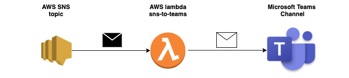

<table>
  <tr>
    <td style="text-align: center; vertical-align: middle;"></td>
    <td style="text-align: center; vertical-align: middle;"></td>
  </tr>
<table>

# AWS SNS to Microsoft Teams

Send SNS topic message to Microsoft Teams channel.

## I - Infrastructure components



## II - Inputs / Outputs

### Requirements

| Name | Version |
|------|---------|
| aws | >= 2.40.0 |

### Providers

| Name | Version |
|------|---------|
| aws | >= 2.40.0 |

### Inputs

| Name | Description | Type | Default | Required |
|------|-------------|------|---------|:--------:|
| aws\_region | aws region to deploy (only aws region with AWS SES service deployed) | `string` | n/a | yes |
| cloudwatch\_log\_retention | The cloudwatch log retention ( default 7 days ). | `number` | `7` | no |
| function\_timeout | The amount of time your Lambda Functions has to run in seconds. | `number` | `300` | no |
| prefix\_resource | The prefix used for all created resources | `string` | `""` | no |
| tags | The tags of all resources created | `map` | `{}` | no |
| teams\_image\_url | The URL of image in Microsoft Teams notification | `string` | `"https://cdn2.iconfinder.com/data/icons/amazon-aws-stencils/100/Compute__Networking_copy_Amazon_VPC_Internet_Gateway-512.png"` | no |
| teams\_webhook\_url | The URL of webhook Microsoft Teams channel | `string` | n/a | yes |

### Outputs

| Name | Description |
|------|-------------|
| lambda\_arn | The Lambda ARN who send SNS topic message to Microsoft Teams |
| role\_arn | The IAM Role ARN used by Lambda who send SNS topic message to Microsoft Teams |
| sns\_arn | The SNS ARN who send SNS topic message to Microsoft Teams |

## III - Usage

```terraform

module "example" {
  source                   = "../"
  aws_region               = "eu-west-3"
  cloudwatch_log_retention = 7
  teams_webhook_url =  "<https:// microsoft teams webhook url>"
}

```
